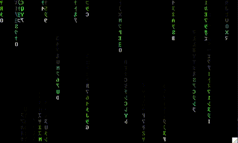

# Matrix Rain

`Matrix Rain` displays the streaming computer code featured in the [Matrix](https://en.wikipedia.org/wiki/The_Matrix_(franchise)) series in a terminal. It is written in `C` and uses `ncurses`. `Matrix Rain` was inspired by a One Lone Coder [YouTube video](https://www.youtube.com/channel/UC-yuWVUplUJZvieEligKBkA) ([Github](https://github.com/OneLoneCoder/), [website](https://community.onelonecoder.com)) and has some similarities with [cmatrix](https://github.com/abishekvashok/cmatrix).



## Usage

The program is compiled with:

```shell
make
```

This results in a binary executable called `matrix.bin` in the parent directory, which is invoked as:

```shell
./matrix.bin
```

## Keys

The following keys are recognized:

key|function
---|--------
f|show frame time
p|pause
q|quit

## Notes

1. `The Matrix` glyphs will be displayed when `xterm` is used as the terminal emulator and the `mtx` font from [cmatrix](https://github.com/abishekvashok/cmatrix) (included here for convenience) is correctly installed.
2. Dynamic resizing of the terminal window is supported.

## BSD-3 License

Redistribution and use in source and binary forms, with or without modification, are permitted provided that the following conditions are met:

1. Redistributions of source code must retain the above copyright notice, this list of conditions and the following disclaimer.

2. Redistributions in binary form must reproduce the above copyright notice, this list of conditions and the following disclaimer in the documentation and/or other materials provided with the distribution.

3. Neither the name of the copyright holder nor the names of its contributors may be used to endorse or promote products derived from this software without specific prior written permission.

THIS SOFTWARE IS PROVIDED BY THE COPYRIGHT HOLDERS AND CONTRIBUTORS "AS IS" AND ANY EXPRESS OR IMPLIED WARRANTIES, INCLUDING, BUT NOT LIMITED TO, THE IMPLIED WARRANTIES OF MERCHANTABILITY AND FITNESS FOR A PARTICULAR PURPOSE ARE DISCLAIMED. IN NO EVENT SHALL THE COPYRIGHT HOLDER OR CONTRIBUTORS BE LIABLE FOR ANY DIRECT, INDIRECT, INCIDENTAL, SPECIAL, EXEMPLARY, OR CONSEQUENTIAL DAMAGES (INCLUDING, BUT NOT LIMITED TO, PROCUREMENT OF SUBSTITUTE GOODS OR SERVICES; LOSS OF USE, DATA, OR PROFITS; OR BUSINESS INTERRUPTION) HOWEVER CAUSED AND ON ANY THEORY OF LIABILITY, WHETHER IN CONTRACT, STRICT LIABILITY, OR TORT (INCLUDING NEGLIGENCE OR OTHERWISE) ARISING IN ANY WAY OUT OF THE USE OF THIS SOFTWARE, EVEN IF ADVISED OF THE POSSIBILITY OF SUCH DAMAGE.
